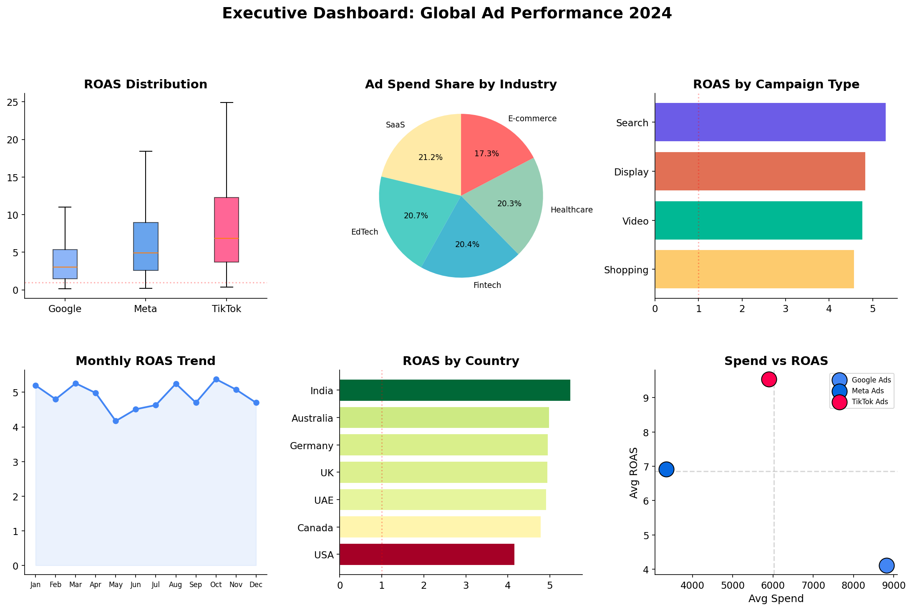
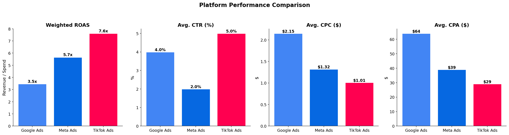
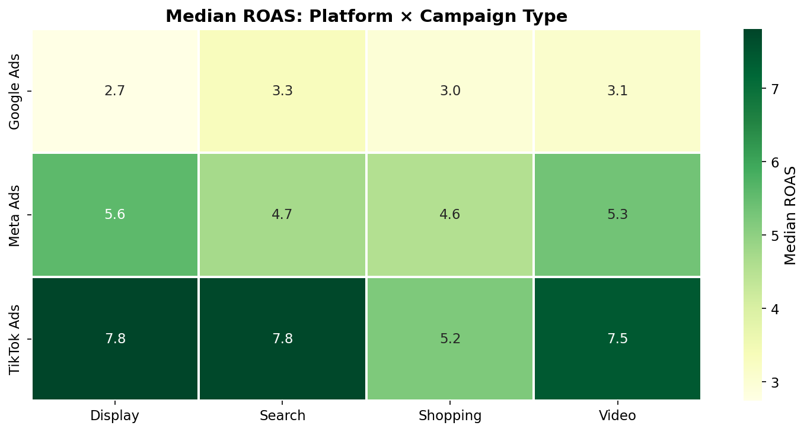
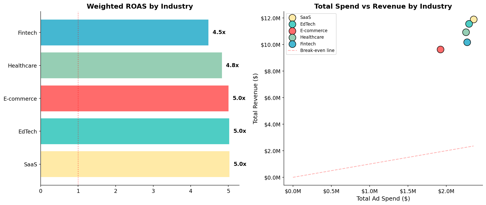
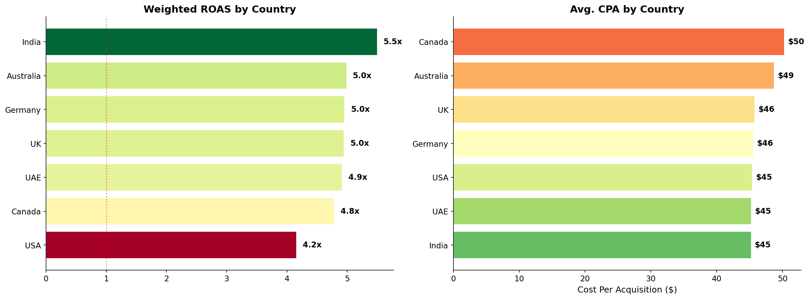
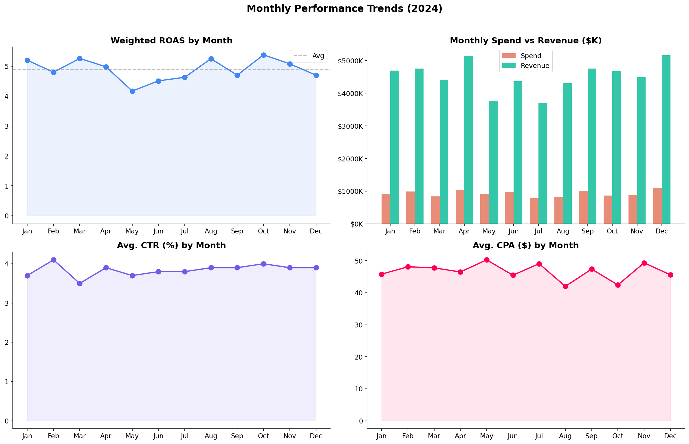
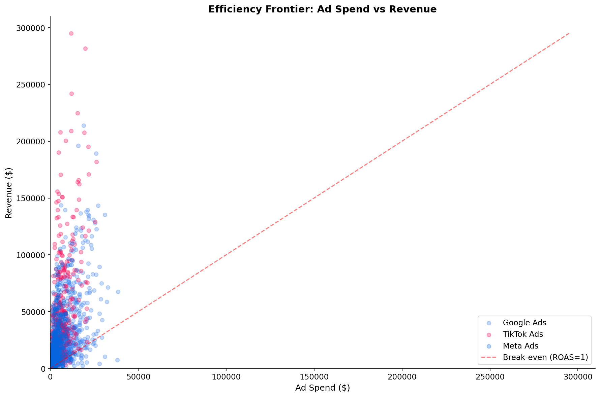

# Global Advertising Performance Analysis (2024)

A comprehensive analysis of 1,800 ad campaigns across Google Ads, Meta Ads, and TikTok Ads, spanning 5 industries and 7 countries. This project demonstrates end-to-end analytics capabilities including data validation, exploratory analysis, statistical hypothesis testing, and strategic recommendations.



---

## Project Overview

| Dimension | Details |
|-----------|---------|
| **Dataset** | 1,800 campaign records, January through December 2024 |
| **Platforms** | Google Ads, Meta Ads, TikTok Ads |
| **Industries** | E-commerce, EdTech, Fintech, Healthcare, SaaS |
| **Countries** | Australia, Canada, Germany, India, UAE, UK, USA |
| **Metrics** | Impressions, Clicks, CTR, CPC, Ad Spend, Conversions, CPA, Revenue, ROAS |

## Tech Stack

- **Python 3.10+**: pandas, numpy, matplotlib, seaborn, scipy
- **Jupyter Notebook** for reproducible analysis
- **Statistical methods**: ANOVA, Kruskal-Wallis, Mann-Whitney U, Cohen's d effect size

---

## Key Findings

### Overall Performance

The dataset captures **$11.1M in total ad spend** generating **$54.2M in revenue**, yielding an aggregate ROAS of **4.88x**. A total of 92.5% of campaigns were profitable (ROAS >= 1), with 19.2% achieving exceptional returns (ROAS >= 10).

### Platform Comparison

| Platform | Weighted ROAS | Avg CTR | Avg CPA |
|----------|:---:|:---:|:---:|
| TikTok Ads | **7.62x** | 5.50% | $29 |
| Meta Ads | 5.66x | 2.50% | $39 |
| Google Ads | 3.47x | 3.99% | $64 |

TikTok Ads leads in both return efficiency and cost per acquisition, though with higher variance in outcomes. Google Ads delivers the most predictable performance but at a significantly higher CPA.



### Campaign Type and Platform Interaction

Search campaigns deliver the highest weighted ROAS (5.31x) overall, but the optimal campaign type varies significantly by platform. The heatmap below reveals that platform selection should always be paired with campaign type consideration.



### Industry Performance

SaaS and EdTech lead with approximately 5.0x weighted ROAS, likely driven by higher customer lifetime values and digital-native audiences. All five industries achieve positive returns, but performance diverges considerably when broken down by platform.



### Geographic Patterns

Meaningful variation exists across markets. India delivers the strongest ROAS, while the USA, despite being the largest market by volume, shows the lowest efficiency. This suggests that market-specific strategies and localized creative are essential for maximizing returns.



### Seasonal Trends

Monthly ROAS fluctuations reveal clear seasonal patterns. Budget pacing aligned to these trends could improve annual returns by shifting spend from low-efficiency months into peak performance windows.



---

## Statistical Rigor

This analysis goes beyond descriptive statistics with formal hypothesis testing:

- **ANOVA and Kruskal-Wallis tests** confirm whether ROAS differences across platforms are statistically significant rather than random noise
- **Pairwise Mann-Whitney U tests** with **Cohen's d effect sizes** quantify the practical magnitude of platform differences
- **Efficiency frontier analysis** visualizes the spend-to-return tradeoff at the individual campaign level, identifying both high performers and waste



---

## Strategic Recommendations

1. **Shift budget toward proven high-ROAS segments.** TikTok Search campaigns in E-commerce (10.7x) and SaaS (9.7x) represent the strongest reallocation opportunities.

2. **Build industry-specific platform playbooks.** No single platform wins everywhere. The platform x industry ROAS matrix should guide channel selection per vertical.

3. **Implement seasonal budget pacing.** Monthly ROAS trends vary meaningfully. Reallocating spend from low-efficiency months into peak performance windows can improve annual returns without increasing total budget.

4. **Audit high-spend, low-ROAS segments.** Several segments consume significant budget while delivering below-average returns. These are the first candidates for creative refresh or budget reallocation.

5. **Expand cautiously in high-ROAS geographies.** Markets with strong efficiency metrics deserve incremental testing, but ROAS alone does not capture total addressable market size.

---

## Repository Structure

```
global-ads-performance-analysis/
├── README.md
├── analysis.ipynb
├── data.csv
├── requirements.txt
└── images/
    ├── 01_distributions.png
    ├── 02_correlation.png
    ├── 03_platform_comparison.png
    ├── ...
    └── 13_executive_dashboard.png
```
